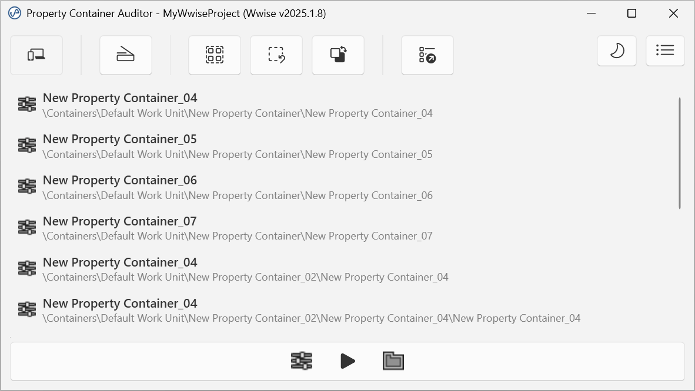

# Waapi Tools

Waapi Tools is a collection of utilities designed to streamline tasks in Audiokinetic's Wwise middleware using the Wwise Authoring API (WAAPI) and Wwise Authoring Query Language (WAQL).

Currently, the project includes the following tool:

- **[PropertyContainerAuditor](https://github.com/jaku5/waapi-tools#property-container-auditor)**: A utility that converts Actor-Mixers / Property Containers into Virtual Folders if they are not utilized for mixing tasks.

- **[TransitionAuditioner](https://github.com/jaku5/waapi-tools#transition-auditioner)**: Audition a single interactive-music transition in-editor, without playing through the material that precedes it.
- More tools coming soon.

## Prerequisites

- **Wwise 2023.1.x** or any newer version.
- **Supported OS:** Windows 10[^1], Windows 11.
[^1]: Note for Windows 10 users: Windows 10 does not include the Segoe Fluent Icons font by default. To ensure proper icon rendering, install the Segoe Fluent Icons font as described in the [Microsoft documentation](https://learn.microsoft.com/en-us/windows/apps/design/iconography/segoe-fluent-icons-font#how-do-i-get-this-font)

## Installation

1. **Download the Release**:
   - Navigate to the [Releases](https://github.com/jaku5/waapi-tools/releases) section of this repository.
   - Download the latest release, which includes:
     - `PropertyContainerAuditor.exe`
     - `jpaudio-waapi-tools.json`

2. **Copy files to the Wwise installation folder**:
   - Locate your Wwise installation directory.
   - Copy the downloaded `PropertyContainerAuditor.exe` into `%WWISEROOT%\Authoring\Data\Add-ons` and `jpaudio-waapi-tools.json` into `%WWISEROOT%\Authoring\Data\Add-ons\Commands` subfolder of your Wwise installation.
   - For more information and other installation methods, refer to the [Audiokinetic documentation](https://www.audiokinetic.com/en/public-library/2022.1.18_8567/?source=SDK&id=defining_custom_commands.html).

## Usage

1. Open Wwise.
2. Access the **Extra** menu in Wwise.
3. Select the command to run the tool.

## Tools
### Property Container Auditor
#### Background
As per [Audiokinetic guidelines](https://www.audiokinetic.com/en/public-library/2022.1.18_8567/?source=SDK&id=goingfurther_optimizingmempools_reducing_memory.html), Actor-Mixers / Property Container should not be used solely for organizing sounds, as they introduce some memory overhead compared to Work Units or Virtual Folders.

#### How it works
The tool will:
- Identify Actor-Mixers / Property Container that can be converted into virtual folders based on the following criteria (all conditions must be met):
    - Actor-Mixer / Property Container has at least one ancestor Actor-Mixer / Property Container.
    - Actor-Mixer / Property Container has no overridden properties or values (i.e., all properties and values are the same as on the closest ancestor Actor-Mixer / Property Container).
    - Actor-Mixer / Property Container has all randomizable property values set to 0 and doesn't have any active randomizer set on them.
    - Actor-Mixer / Property Container has no RTPCs with control inputs.
    - Actor-Mixer / Property Container has no states with defined values.
    - Actor-Mixer / Property Container is not referenced by any event action.
- List all Actor-Mixer / Property Container candidates' names and IDs in the UI, allowing you to select and manage them (e.g., Show in List View or Find in Project Explorer).
- Prompt you to confirm the conversion for selected candidates.

> [!NOTE]
> Please note that this tool is considered experimental; be careful when using it in production and preferably have source control set up to inspect the diffs or restore backups. Especially since it is meant to be used at the end of production, after the mixing stage, when you know you won't need these Actor-Mixers / Property Container for mixing tasks. That said, you should be able to undo all the changes made by the tool with <kbd>Ctrl</kbd> + <kbd>Z</kbd>.

### Transition Auditioner
#### Background
In Wwise interactive music, transitions fire only at their defined points (bars, cues, segment ends). To hear one specific transition you often have to start playback well before it and listen through the intervening material — then redo the wait after every tweak. This tool automates a community technique (wrapping the structure in a parent Music Switch Container with a *Jump to playlist item* + custom-cue transition rule) so that checking one transition becomes a one-step action.

It is the live, in-editor, single-transition counterpart to offline approaches like [Music Render](https://www.audiokinetic.com/en/blog/) — complementary, not competing.

#### How it works
1. In Wwise, **select** a Music Switch Container, Music Playlist Container, or Music Segment in the Project Explorer.
2. Run **Extra → Audition Music Transition**. The tool connects and shows the selected target.
3. Set the **cue offset from end** (in seconds, default 1 s) and the **length basis** — *Exit cue* (where the transition fires, the default), *Segment end* (the segment's `@EndPosition`, including any post-exit tail), or *Audio length* (the longest audio source's trimmed duration) — then click **Set Up & Audition**. The tool:
   - Builds a Music Switch Container harness at the root of the target's own Work Unit (wrapped in a single undo group, so your undo history is preserved).
   - **Copies** the selected structure into the harness (the production structure is copied, never moved or mutated).
   - Places one custom cue the chosen offset before each Music Segment's end, so you can jump to the run‑up into the transition instead of playing the whole segment.
   - Assigns the copy as the harness's generic path, and adds a transition rule (Source **None** → **target**, Sync to **Random Custom Cue**, matching the audition cue) as the highest‑priority rule in the container.
   - Creates a transport, ready to audition.
   - Selects the harness in the Project Explorer and inspects it (its Transitions tab holds the None→target rule). For a Music Playlist Container target, if **Open Playlist Editor** is checked, it also opens the Music Playlist Editor showing the copied playlist.
4. Click **▶ Play** in the tool to hear the transition (and **■ Stop** to stop) — playback runs through the tool's own transport, no need to touch Wwise. **Show in Project Explorer** re-reveals on demand. Adjust the offset and click **Set Up & Audition** again to rebuild.
5. Click **Finish & Clean Up** (or just close the window) — the harness (and everything in it) is deleted. The project is never saved.

> [!NOTE]
> This is an MVP (v1). It sets up the audition and you press Play; a fully automatic playback trigger and a transition-picker panel are planned for a later version. The transition rule is built automatically (the `MusicTransition` object model is identical across Wwise 2021–2025); if it can't be set for any reason, the harness is still left playable so you can finish the rule by hand. Teardown runs even on error, so the tool never leaves scaffolding behind.

## License

This project is licensed under the Apache License, Version 2.0. See the [LICENSE](LICENSE) file for details.

---

Feel free to contribute by submitting pull requests or reporting issues to help improve this project!
