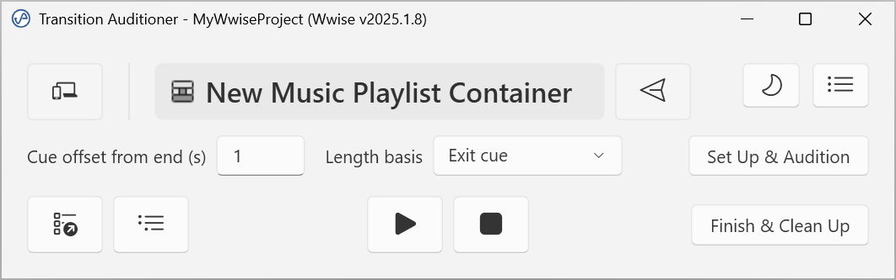

# Transition Auditioner

Audition a single interactive-music transition in-editor, without playing through the material that precedes it.

## Background
Wwise 2026 introduces [Music Playlist Seek](https://www.audiokinetic.com/en/public-library/2026.1.1_9196/?source=SDK&id=whatsnew_2026_1_new_features.html&hsCtaAttrib=213427121072#user_experience), a first-party solution to the same problem that will likely supersede this tool, but as of writing 2026 is still in beta and not supported by Audiokinetic for production projects. This tool remains useful for projects on earlier versions (2023.1.x – 2025) where there is no built-in equivalent.

On those versions, to hear one specific transition you often have to start playback well before it and listen through the whole segment, then redo your transition and wait again to audition the change. This way of working is not only time consuming but decreases focus and flow. This tool automates a community workaround technique (wrapping the structure in a parent Music Switch Container with a *Jump to playlist item* + custom-cue transition rule) so that checking one transition becomes a one-step action.

## How it works
1. In Wwise, **select** a Music Switch Container, Music Playlist Container, or Music Segment in the Project Explorer.
2. Run **Extra → Audition Music Transition**. The tool connects and shows the selected target. To change the target later without reopening, select a different object in Wwise and click **Pull Selection**.
3. Set the **cue offset from end** (in seconds, default 1 s) and the **length basis** — *Exit cue* (where the transition fires, the default), *Segment end* (the segment's `@EndPosition`, including any post-exit tail), or *Audio length* (the longest audio source's trimmed duration) — then click **Set Up & Audition**. The tool:
   - Builds a Music Switch Container harness at the root of the target's own Work Unit (wrapped in a single undo group, so your undo history is preserved).
   - **Copies** the selected structure into the harness (the production structure is copied, never moved or modified).
   - Places one custom cue the chosen offset before each Music Segment's end, so you can jump to the run‑up into the transition instead of playing the whole segment.
   - Assigns the copy as the harness's generic path, and adds a transition rule (Source **None** → **target**, Sync to **Random Custom Cue**, matching the audition cue) as the highest‑priority rule in the container.
   - Creates a transport, ready to audition.
   - Selects the harness in the Project Explorer and inspects it (its Transitions tab holds the None→target rule). For a Music Playlist Container target, you can also use **Open Playlist Editor** to open the Music Playlist Editor showing the copied playlist.
4. Click **▶ Play** in the tool to hear the transition (and **■ Stop** to stop) — playback runs through the tool's own transport, no need to touch Wwise. **Show in Project Explorer** re-reveals on demand. Adjust the offset and click **Set Up & Audition** again to rebuild.
5. Click **Finish & Clean Up** (or just close the window) — the harness (and everything in it) is deleted. The project is never saved.

### Acknowledgments

Thanks to [Aaron Brown](https://www.aaronbrownsound.com/) for sharing his write up of this workaround technique that inspired this tool.